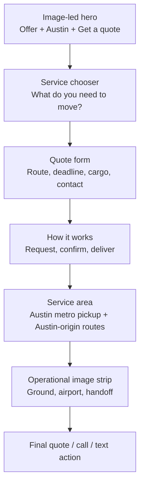

# Speedy Bat website redesign plan

## Direction

Use United Carriers as the primary visual benchmark: bold geometric type, cinematic transport photography, asymmetric layouts, strong black-and-white contrast, and short copy. Translate that system to a small Austin courier. The site should show compact vehicles, handoffs, parts, documents, Austin roads, and airport cargo activity rather than container ships or large fleets.

The homepage should answer three questions in the first screen:

1. What is this? An Austin courier for same-day delivery, expedited freight, and scheduled routes.
2. Can it handle my need? The service list and Austin-origin coverage make that clear.
3. What do I do next? Get a quote, call, or text.

The visual concept is recorded in `speedy-bat-homepage-concept.png`. It is a design reference, not a final production asset. Its transport image is illustrative and must be replaced with licensed or commissioned photography before publication.

## Research findings

| Reference | What works | Apply to Speedy Bat | Do not copy |
| --- | --- | --- | --- |
| [United Carriers homepage](https://unitedcarriers.com/) and [Mobbin hero](https://mobbin.com/sites/sections/c8909427-c897-42f7-8ad7-e91197df7ed9) | Cinematic transport images carry the layout. Large type makes one clear claim. Small labels and sparse navigation give the brand confidence. | Use an image-led hero, large square letterforms, white editorial sections, cobalt details, irregular image crops, and very short supporting copy. | Global scale, container imagery, service claims, branded vehicles, or the company's exact slogan. |
| [United Carriers service section](https://mobbin.com/sites/sections/4987af31-2f8f-4b7a-ae54-884e327e7f1f) | Services are represented by distinct operational images instead of repeated icon cards. | Pair service groups with ground, airport, parts, and document imagery. Let image scale vary. | A four-column template that makes every service feel equal. Speedy Bat needs priority tiers. |
| [Dropoff Austin](https://www.dropoff.com/locations/austin/) | The opening names both the service and city, then presents one sales action. A simple process follows. | Keep Austin and courier service in the first screen. Put route and deadline fields first in the quote flow. | Unsupported guarantees, availability claims, client logos, testimonials, certifications, pricing promises, or tracking claims. |
| [Airspace](https://www.airspace.com/) | One-line positioning, strong imagery, a short service set, and direct calls to action make a complex offer understandable. | Group services by customer need and give each one sentence. Use an urgent, operational visual tone. | Metrics, enterprise customers, AI routing, global coverage, medical capabilities, or platform features Speedy Bat cannot prove. |
| [DHL Global Forwarding](https://www.dhl.com/us-en/home/global-forwarding.html) | Literal product names help visitors self-select. Quote and contact actions stay visible. | Use plain service names and a consistent quote action across pages. | Enterprise navigation depth and global-forwarding language that does not match a local courier. |
| [Courier Express](https://courierexpress.net/) | Vehicles and real operating environments quickly establish the category. | Commission authentic Austin courier photography. | A company history paragraph before the customer offer. |

The category pattern is useful but often verbose. Most sites repeat reliability, speed, flexibility, technology, and customer care without demonstrating them. Speedy Bat should be more concrete: route, deadline, cargo, service, and the next action.

## Information architecture

Keep the current routes for search continuity, but simplify the visible navigation:

- Services
- Service area
- How it works
- About
- Call or text: (512) 910-4938
- Primary button: Get a quote

Move FAQ to the footer and contextual links. Keep Privacy and Service Terms in the footer. Keep all existing service URLs and redirects.

### Homepage order

The quote form should appear immediately after the service chooser on desktop and after the hero on mobile. A compact “Get a quote” button in the hero scrolls to it.

## Visual system

### Composition

- Use a 12-column editorial grid with deliberate empty space.
- Replace the current split hero and large form card with a full-width photographic hero. The action remains visible in the hero; the complete form sits directly below.
- Alternate full-bleed photography with white, text-led sections.
- Use large type as structure. Avoid repeated rounded cards, icon tiles, glass panels, glows, paper grids, and decorative route diagrams.
- Keep corners nearly square. Buttons and fields use a 4-6px radius.
- Give each service group a different photographic crop and scale so the page reads like a logistics brand, not a software template.

### Color

- Ink: `#101116`
- White: `#FFFFFF`
- Soft gray: `#F1F2F4`
- Cobalt action color: `#244CE8`
- Muted body text: `#565B64`

Cobalt should occupy one clear region or a few decisive controls. Do not scatter it as decorative dots. Replace the current warm paper and orange system throughout so the homepage and inner pages feel like one site.

### Type

- Display: a licensed, wide geometric grotesk with squared forms and a complete web font set. Use it in uppercase for major statements and service labels.
- Body: keep the self-hosted DM Sans initially because it is readable and already available.
- Use sentence case for paragraphs and controls. Reserve uppercase for navigation, eyebrows, and major display moments.
- Set body copy at 17-19px with short line lengths. Do not use tiny light-gray paragraphs as the main explanation.

### Photography brief

Commission or license five coherent images with natural light, real surface texture, and minimal staging:

1. Hero: one compact courier vehicle on an Austin-area road; wide overhead or elevated composition with room for type.
2. Same-day: a document or small parcel handoff at a real business entrance.
3. Expedited freight: an urgent machine part or flight case being loaded into a cargo-capable vehicle.
4. Airport: cargo-terminal exterior, baggage or freight handoff, or airport roadway; no implied ramp access.
5. Scheduled routes: a repeat pickup scene with clearly organized parcels or business supplies.

Avoid generic handshakes, smiling call-center agents, enormous warehouse fleets, medical specimens, security theater, and stock imagery that implies certifications or capabilities.

Every published image needs useful alt text when it adds information. Decorative crops should have empty alt text. Deliver AVIF or WebP at responsive widths with explicit dimensions.

## Copy rules

- Lead with what moves, where it starts, and how to request it.
- Use “Get a quote” as the primary action everywhere. Use “Call” and “Text” as secondary actions.
- Say “dispatch confirms availability and price before booking” once near the form. Do not repeat a long list of qualifications in every section.
- Put service-specific limits on their service pages, inside a short “Before you book” section.
- Put privacy restrictions beside the optional details field and in the privacy notice, where they affect behavior.
- Use “Austin metro pickup” and “Austin-origin routes” consistently.
- Do not publish statistics, testimonials, customer logos, certifications, guaranteed timing, tracking promises, insurance limits, or institutional relationships until evidence exists.
- Keep legal and operational accuracy, but write for a customer. Replace internal phrases such as “job-specific operating model,” “request reviewed,” “applicable coverage,” and “eligibility and limits” with direct answers.

## Quote flow

The current form asks for useful information but reads like a review application. Redesign it as a route-first quote form.

### Visible fields

1. Pickup ZIP
2. Destination ZIP
3. Delivery deadline
4. What are you sending? Documents / parcel / parts / freight / other
5. Approximate size and weight
6. Name or company
7. Phone or email
8. Anything else? Optional

On desktop, put pickup and destination side by side, then deadline and cargo type side by side. On mobile, use one column. Keep no more than four inputs visible before the first natural pause.

Form title: **Get a courier quote**  
Form helper: **Share the route, deadline, and item size. We’ll follow up with availability and price.**  
Submit: **Request a quote**  
Confirmation: **Request received. Dispatch will contact you using the phone number or email you provided.**  
Failure: **We couldn’t send your request. Call or text (512) 910-4938.**

Place this beside the optional details field:

> Keep health information, account numbers, IDs, access codes, and detailed descriptions of valuables out of this form and text messages.

Place this under the submit button:

> Sending a request does not book a courier. Dispatch confirms availability, price, and service details first.

## Page templates

### Service hub

Open with “Courier services from Austin” and one sentence. Show three groups:

- **Local & direct:** Same-Day Courier; Long-Distance Direct Drive; Scheduled & Recurring Routes.
- **Urgent freight:** Hot Shot & Expedited Freight; Manufacturing Line-Down Delivery.
- **Airport & specialty:** Airport Recovery / NFO / AOG; Air Hand Carry / On-Board Courier; Legal Courier & Document Delivery; High-Value & Secure-Item Courier.

Every card gets a service name, one sentence, one image, and “View service.” Remove review dates, internal service groups, and “review eligibility and limits” labels from the public interface.

### Service pages

Use the same order on every service page:

1. Service name, one-line description, Get a quote.
2. “Good for” with three concrete examples.
3. One operational photograph.
4. “How it works” in three short steps.
5. “What to send” with the fields needed for that service.
6. “Before you book” with two or three material limits.
7. Two service-specific FAQs.
8. Related services and final quote action.

Remove the repeated generic disclaimer card, the long capabilities list, the separate exceptions section, review stamps, and repeated explanations of dispatch review. Preserve material facts once in the most relevant location.

### Service area

Title: **Courier pickup in the Austin metro**  
Intro: **We pick up across Austin and nearby communities, subject to availability. Need delivery farther away? Ask about an Austin-origin direct route.**

Use one simple area list or map with two clear labels:

- Austin metro pickup: Austin neighborhoods and nearby communities currently listed in the site data.
- Austin-origin destinations: farther Texas destinations such as Killeen, Temple, New Braunfels, and Salado.

Add one short note: **A listed area is not a guarantee of availability. Send the route and deadline for confirmation.** Remove the three near-duplicate explanatory panels.

### How it works

Title: **From pickup request to delivery**

1. **Send the basics.** Pickup, destination, deadline, item type, and approximate size.
2. **Confirm the job.** Dispatch confirms availability, price, service, and handoff details.
3. **Hand it over.** The courier completes the accepted route and provides the update or delivery confirmation arranged for the job.

Keep the sensitive-information note once at the end.

### About

Title: **Austin courier service for the jobs that cannot wait**  
Body: **Speedy Bat Couriers arranges same-day delivery, expedited freight, airport recovery, scheduled routes, and specialized courier work from the Austin metro. Send us the route, deadline, and item details. We’ll tell you whether we can take the job and what it will cost.**

Do not add a founder story, team size, history, fleet count, or values section until real source material is available.

### FAQ

Reduce the main FAQ to eight questions:

1. How do I get a quote?
2. How soon can you pick up?
3. Where do you pick up?
4. How is pricing calculated?
5. Can I request direct delivery?
6. Do you handle airport recovery and NFO shipments?
7. Will I receive updates or delivery confirmation?
8. What should I leave out of the quote form?

Move legal-document, air hand-carry, secure-item, and regulated-cargo answers to their service pages. Keep the privacy and terms pages factual and complete; their density is appropriate for policy content.

## Responsive and interaction behavior

- Desktop hero: at least 75vh, with headline occupying roughly 45% of the image.
- Mobile hero: use a portrait crop, 60-70vh, four-line headline, and one primary button. Put call and text in a sticky bottom contact bar.
- Keep navigation visible on desktop. Mobile menu should contain only the four primary links plus quote, call, and text.
- Use one restrained motion system: slow image-mask reveals on section entry and a single headline reveal. Content must remain visible if JavaScript is slow, paused, or unavailable.
- Avoid horizontal marquees and constantly moving route dots. Motion should not compete with someone trying to submit a quote.
- Respect reduced-motion preferences and retain the current keyboard, focus, validation, and live-status behavior.

## Implementation sequence

### Phase 1: content and structure

- Replace homepage order and copy using `website-copy.md`.
- Update navigation labels and make “Get a quote” the single primary action.
- Convert service data from long overview/eligibility/limits/process/exception arrays to the concise service-page model, while keeping route IDs and metadata.
- Consolidate repeated coverage language and FAQs.
- Keep structured data and canonical routes intact.

### Phase 2: visual system and assets

- Replace the current warm paper/orange/glass-panel system with the black, white, gray, and cobalt system.
- Build the image-led hero and editorial service modules.
- Source or commission the five-image photography set, with written licenses and releases where required.
- Replace old logo artwork with a clean text wordmark if no suitable vector brand asset exists. Keep the company name unchanged.

### Phase 3: quote flow

- Add a cargo-category field.
- Reorder the form to start with route and deadline.
- Keep the current submission endpoint and successful-lead event behavior unless a separate security review changes them.
- Add attribution for cargo category and service interest without sending entered contact or shipment details to analytics.
- Test validation, success, network failure, keyboard use, and screen-reader announcements.

### Phase 4: quality and measurement

- Test at 1440px, 1024px, 768px, and 390px widths.
- Verify the first screen clearly states courier service, Austin, and the quote action within five seconds.
- Confirm text remains visible with motion disabled and before client-side hydration.
- Run the existing build and SEO regression checks. Confirm titles, descriptions, canonical URLs, sitemap, redirects, and service structured data.
- Record the redesign launch date. Because the existing experiment baseline is still unavailable, establish a fresh pre/post measurement note rather than attributing future changes to the earlier page treatment.
- Track quote completions, call clicks, text clicks, form abandonment by field, qualified inquiries, and accepted jobs. Do not optimize around raw lead count alone.

## Acceptance criteria

- A first-time visitor can identify the offer, service area, and next action from the first screen.
- The homepage has one H1, one primary action label, and no paragraph longer than three lines at desktop width.
- All nine services are reachable in two clicks and described in one sentence on the service hub.
- The public pages do not repeat the full dispatch qualification statement.
- No unsupported claims or implied capabilities are introduced.
- The quote form sends the same operational essentials and has clear success and failure states.
- The experience remains usable with keyboard controls, reduced motion, JavaScript delays, and small screens.
- The new photography depicts Speedy Bat's actual scale and service context.

